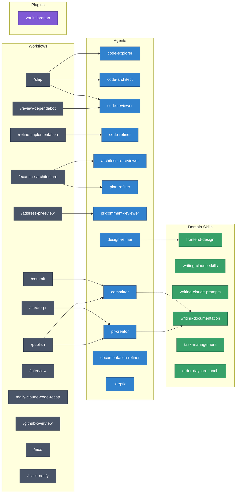

# AI Coding Agent Configuration

Custom agents, skills, and workflows for Claude Code.

## Setup

This repository serves two roles:

1. **Claude Code dotfiles** — `agents/`, `skills/`, `hooks/`, `AGENTS.md`, `mcp.json`, `claude-settings.json`, and `statusline.sh` are symlinked into `~/.claude/` via chezmoi (external at `https://github.com/abhijit-s/ai.git`).

2. **Plugin marketplace** — standalone plugins under `plugins/` with a root `.claude-plugin/marketplace.json`.

### Installing a Plugin

```bash
claude plugin install https://github.com/abhijit-s/ai.git --plugin vault-librarian
```

### Local Development

```bash
# Test locally without installing
claude --plugin-dir ./ai

# Pick up changes during development
/reload-plugins
```

### Repository Structure

```
ai/
├── .claude-plugin/
│   └── marketplace.json      ← plugin marketplace manifest
├── plugins/
│   └── vault-librarian/           ← Markdown vault curation plugin
│       ├── .claude-plugin/
│       │   └── plugin.json
│       ├── skills/vault-librarian/
│       │   └── SKILL.md
│       ├── scripts/          ← vault_librarian.py Python package
│       ├── config/
│       └── references/
├── agents/                   ← subagent definitions
├── skills/                   ← global slash command workflows
├── hooks/                    ← event handlers
├── AGENTS.md
├── mcp.json
├── claude-settings.json
└── statusline.sh
```

---

## Architecture

Workflows orchestrate multi-step processes by spawning agents, which may load domain skills for expertise.



**Legend**: Workflows (gray) spawn Agents (blue) which load Domain Skills (green). Plugins (purple) are independently installable.

---

## Workflows

| Workflow                   | Purpose                                            |
| -------------------------- | -------------------------------------------------- |
| `/commit`                  | Commit with conventional message (why > what)      |
| `/create-pr`               | Create PR with concise description                 |
| `/ship`                    | Autonomous end-to-end feature development          |
| `/refine-implementation`   | Multi-pass quality review before committing        |
| `/examine-architecture`    | Evaluate codebase for structural problems          |
| `/address-pr-review`       | Resolve unresolved PR review comments              |
| `/review-dependabot`       | Analyze and merge Dependabot PRs with safety check |
| `/publish`                 | End-to-end release workflow (branch, PR, tag, npm) |
| `/interview`               | Interview user about a plan before implementation  |
| `/daily-claude-code-recap` | Summarize the day's Claude Code sessions           |
| `/github-overview`         | GitHub PR dashboard for organization               |
| `/nico`                    | General-purpose notification dispatcher (Slack, email) |
| `/slack-notify`            | Send a structured notification to a Slack channel  |

### Execution Flow Examples

```
/ship "Add user authentication"
  Discovery -> Exploration (code-explorer) -> Architecture (code-architect)
  -> Implementation -> Review (code-reviewer) -> Summary

/refine-implementation
  code-refiner: simplicity -> configuration compliance -> conventions
  -> Reconcile changes, iterate if needed

/examine-architecture
  architecture-reviewer (parallel, one per surface)
  -> Consolidate findings -> plan-refiner validates fixes

/publish
  Gather context -> Ask release type -> committer: release commit
  -> pr-creator: release PR -> Merge, tag, push -> Monitor CI
```

---

## Agents

| Agent                     | Purpose                                            |
| ------------------------- | -------------------------------------------------- |
| **code-explorer**         | Trace execution paths, map dependencies            |
| **code-architect**        | Design feature architectures                       |
| **code-reviewer**         | Review for bugs, security, conventions             |
| **code-refiner**          | Simplify complexity, improve maintainability       |
| **architecture-reviewer** | Evaluate brittleness, complexity, coupling         |
| **plan-refiner**          | Validate plans, suggest simpler approaches         |
| **pr-comment-reviewer**   | Evaluate PR comments for actionability             |
| **committer**             | Create commits with conventional messages          |
| **pr-creator**            | Create PRs with structured descriptions            |
| **design-refiner**        | Iteratively refine frontend designs                |
| **documentation-refiner** | Maintain Markdown files and developer docs         |
| **skeptic**               | Challenge conclusions before they reach the user   |

---

## Domain Skills

Domain skills provide expertise activated automatically by context.

| Skill                      | Trigger                          |
| -------------------------- | -------------------------------- |
| **frontend-design**        | Building web interfaces          |
| **writing-documentation**  | Updating docs                    |
| **writing-claude-skills**  | Creating Claude Code skills      |
| **writing-claude-prompts** | Writing prompts for Claude       |
| **task-management**        | GTD workflow with OmniFocus      |
| **order-daycare-lunch**    | School lunch ordering            |

---

## Plugins

Plugins are independently installable units that bundle a skill, scripts, and configuration. Install from the marketplace:

```bash
claude plugin install https://github.com/abhijit-s/ai.git --plugin <plugin-name>
```

| Plugin          | Skill         | Purpose                                                                 |
| --------------- | ------------- | ----------------------------------------------------------------------- |
| **vault-librarian**  | `/vault-librarian` | Curate any Markdown knowledge vault: catalogue, classify, audit, repair frontmatter, rename with link rewrite, check broken links, inject emoji sigils, infer tags, and detect themes. Works with Obsidian, mkdocs, Jekyll, or any `.md` tree with YAML frontmatter. |

---

## MCP Servers

The `mcp.json` file defines MCP server connections:

| Server          | Purpose                       |
| --------------- | ----------------------------- |
| **betterstack** | Logging and uptime monitoring |
| **chartmogul**  | Revenue analytics             |
| **helpscout**   | Customer support              |
| **omnifocus**   | Task management               |
| **superset**    | Data exploration               |
| **ynab**        | Budget tracking               |

Run `./generate-mcp.sh` to sync servers to Claude Desktop, Claude CLI, and Codex CLI.
