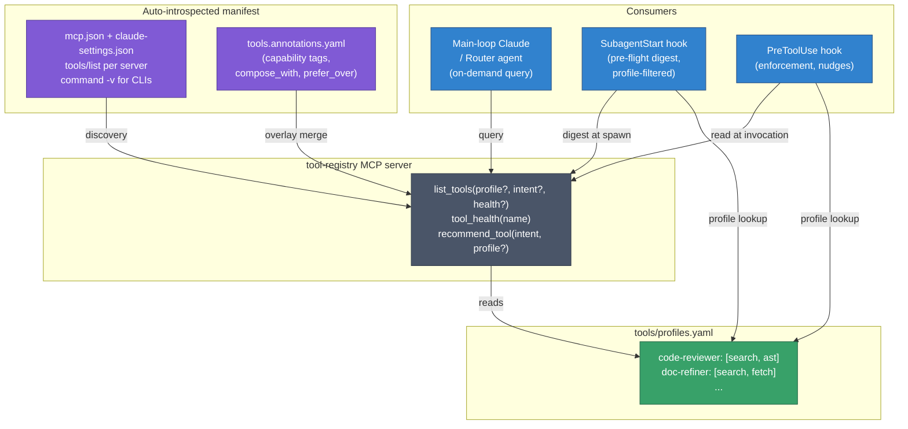

# Materialised Tool Discovery — Requirements

## Summary

A tool-registry layer for the `ai/` dotfiles repo: a `tool-registry` MCP server plus a `SubagentStart` / `PreToolUse` hook integration that both read the same auto-introspected, profile-filtered manifest. The registry sits between the deferred-tool zone and the LLM's tool-selection moment, giving the LLM (via on-demand query) and the hook layer (via direct file read) a richer view than the bare tool name strings available today. Exploration tools (`fff` MCP, `ast-grep`, `rg`, `fd`, `grep`, `find`, `turbo-rag` `semantic_search`) form the prototype slice; the design must extend to future tool categories without registry-code changes.

## Problem Frame

Tool selection in the current setup is shaped by three context surfaces: the eager-zone schemas always present in the prompt, the deferred-zone names (no schemas — must `ToolSearch` before use), and one-shot system-reminders injected at session start (`AGENTS.md` tool hierarchy, MCP server instructions, `SessionStart` hook output). The deferred zone is a flat list of names with no capability or health metadata; the system-reminder zone never updates after session start. Four frictions follow:

- Tools fail silently mid-task when an MCP server is down or unauthenticated.
- The LLM doesn't realise a tool exists because its name in the deferred list doesn't trigger a `ToolSearch`.
- Training-time priors override the `AGENTS.md` hierarchy (the LLM reaches for `grep` despite the fff-first rule).
- Context burns when the wrong deferred-tool schemas are loaded.

The existing `PreToolUse` hook (fff-vs-rg nudge) and `SubagentStart` guideline injection prove the substrate works; what's missing is a structured registry both consumers can read from.

The fuller lifecycle is documented in the vault: `KnowledgeBase/06-Engineering Practice & AI/AI/Claude Code Tool Registry/How Claude Code Surfaces Tools Today.md`.

## Key Decisions

- **Consumer = hook + queryable MCP server, sharing one registry.** The same source of truth backs deterministic enforcement (hook nudges/blocks based on health and profile) and on-demand LLM query (`list_tools`, `tool_health`, `recommend_tool`). Neither replaces the other.
- **Approach B — auto-introspected catalog with thin annotation overlay.** The registry discovers tools by reading `mcp.json` + `claude-settings.json` and calling `tools/list` on each MCP server, plus `command -v` + version probe for CLI tools. Non-inferable metadata (compose-with hints, `prefer_over` / `fallback_to` relationships, capability tags) lives in a small `tools.annotations.yaml` overlay. Rejected A (hand-authored — drifts as MCP servers are added) and C (LLM-curated — defers to a later graduation once intent-matching pressure justifies the regeneration workflow).
- **Full profile system from day 1, mirroring `hooks/guidelines.json`.** Every agent gets a profile entry that filters which tools the registry surfaces to it. Per-spawn override uses the existing `<!-- inject: ... -->` comment idiom, adapted as `<!-- tools: ... -->`.
- **Profiles reference categories AND names.** Adding a new tool that fits an existing category (e.g., a new `mcp__fff__*` cousin) flows into the right profiles automatically — no profile edits required.
- **Day-1 seed from `AGENTS.md`.** The `prefer_over` / `fallback_to` rules already encoded in the `AGENTS.md` tool hierarchy section seed the annotation overlay on day 1, so the registry ships with the same enforcement the existing nudge hook implements.

## Topology

## Requirements

**Registry and manifest**

- **R1.** The registry produces a single manifest entry per discoverable tool, comprising: stable name, source (MCP server name + tool name, or CLI binary path), schema (when available), human description (server-supplied or annotation override), category (one or more tags from a controlled vocabulary), capability tags, and live health state.
- **R2.** Tool discovery is automatic: the registry reads `mcp.json` and the MCP block of `claude-settings.json`, calls `tools/list` on each reachable server, and enumerates CLI tools by attempting `command -v` against a configured list (resolved from the same source the existing `PreToolUse` nudge hook uses today).
- **R3.** Non-inferable metadata is supplied by a single `tools.annotations.yaml` overlay file. Overlay entries are keyed by tool name; missing entries are tolerated (the tool flows through with auto-discovered fields and sane defaults).
- **R4.** Health state is computed per tool: MCP tools = `tools/list` handshake succeeded; CLI tools = `command -v` returned a path. Health is captured at registry build time, cached for the session, and re-resolvable on demand via `tool_health(name)`.
- **R5.** The `AGENTS.md` tool-hierarchy section is the day-1 source of `prefer_over` / `fallback_to` relationships in the annotation overlay. Extraction is a one-time operation; subsequent maintenance happens in the overlay file.

**Profiles**

- **R6.** A profile is a named filter that constrains which tools the registry surfaces to a specific agent type. Profiles reference both categories (`search-content`, `find-files`, `semantic-search`, `git-state`, …) and individual tool names; the union is the set of allowed tools for that profile.
- **R7.** Every agent type defined in `agents/` has a profile entry. The profile catalog is colocated with the existing `hooks/guidelines.json` mechanism (see Outstanding Questions for the file-layout fork). Profile coverage extends to the main session (see R16) so the `PreToolUse` hook has a defined profile to consult on every call, not only inside subagent context.
- **R8.** A per-spawn override allows a caller to override the agent type's default profile via a comment annotation in the spawn prompt, using the same idiom as the existing guideline-injection mechanism (`<!-- tools: profile-name -->` or `<!-- tools: tool1,tool2 -->`).
- **R16.** A **main-session profile** (`session-default`) covers `PreToolUse` invocations fired outside any subagent spawn — i.e., the main-loop Claude session. It shares the same shape as agent profiles (category and name filter, override comment) and the same enforcement contract via the `PreToolUse` hook. Default contents are broadly permissive (the union of healthy exploration-tool categories) so the registry never blocks legitimate main-thread work by default; tightening happens by user edit, not by default.

**MCP server surface**

- **R9.** The registry is exposed as an MCP server (`tool-registry`) declared in `mcp.json`, callable from any Claude Code session. Tools exposed: `list_tools(profile?, intent?, health?)`, `tool_health(name)`, `recommend_tool(intent, profile?)`, `list_profiles()`.
- **R10.** `list_tools` returns the manifest filtered by the given arguments. With no arguments, returns the full healthy set. With `profile`, restricts to the profile's allowed tools. With `intent`, filters by capability-tag overlap. With `health=true`, restricts to currently-healthy tools.
- **R11.** `recommend_tool(intent, profile?)` returns the highest-scoring tool for the given intent within the profile's allowed set, scored by capability-tag overlap and respecting `prefer_over` / `fallback_to` relationships from the annotation overlay.

**Hook integration**

- **R12.** A `SubagentStart` hook reads the spawning agent's profile, queries the registry for the profile's allowed-and-healthy tool set, and injects a compact manifest digest as a system-reminder into the subagent's context.
- **R13.** The existing `PreToolUse` hook is extended (or replaced by a hook that subsumes its responsibilities) to consult the registry on every tool call: if the called tool is outside the active profile or known-unhealthy, the hook nudges or blocks per the registry's `prefer_over` and health metadata.

**Extensibility**

- **R14.** Adding a new MCP server to `mcp.json` requires zero registry code changes. The server's tools appear in the manifest after the next `SessionStart` (or registry refresh) with default category assignment based on name heuristics and any overlay annotations the user adds.
- **R15.** Adding a new tool category requires only an overlay annotation and (optionally) a profile entry referencing the new category. No registry code change.

## Acceptance Examples

**AE1. Healthy MCP, profile match.** A `code-reviewer` agent is spawned with default profile `[search, ast]`. The `SubagentStart` hook injects a digest listing `mcp__fff__grep`, `mcp__fff__multi_grep`, `ast-grep`, and `rg` (in `prefer_over` order). When the agent calls `mcp__fff__grep`, the `PreToolUse` hook reads the registry, confirms the tool is in-profile and healthy, and allows the call.

**AE2. Unhealthy MCP at session start.** `mcp__turbo-rag__*` fails the `tools/list` handshake. The registry marks `turbo-rag` tools as `health=unhealthy`. `SubagentStart` digests exclude them. If the LLM still calls `mcp__turbo-rag__semantic_search`, the `PreToolUse` hook **nudges** the call with a clear message naming the failure mode and the nearest healthy alternative.

**AE2 — graduation contract for blocking.** Blocking (vs nudging) on unhealthy tools is the long-term endpoint of AE2, gated behind a per-profile `block_unhealthy` flag that ships **default false** in v1. The flag default flips to `true` (per profile, not globally) when **all three** conditions hold for that profile, measured from the search-tool audit log at `~/.claude/logs/search-tool-audit.jsonl`:

- **Volume.** At least 50 sessions of nudge-mode evidence with the profile active.
- **Precision.** False-positive rate (a tool nudged as unhealthy but that succeeded when called, or that the user manually re-attempted and confirmed) ≤ 2% over the 50-session window.
- **Validation.** At least one end-to-end case where an unhealthy-tool nudge correctly steered the LLM to a healthy alternative that produced the expected result, captured in the audit log.

Per-profile graduation is intentional: high-confidence profiles (e.g., `code-reviewer` with a tight allowlist) can flip earlier than broad ones (e.g., `session-default`). The criterion is review-and-flip, not auto-flip — a human reviews the audit log and edits the profile.

**AE3. New MCP server appears.** The user adds a new MCP server to `mcp.json`. On the next session, the registry discovers it, surfaces its tools with a default `unannotated` category, and they appear in profiles whose filter matches `*` or the new category. The user later adds a one-line annotation overlay entry tagging the new server's tools with capability tags; subsequent sessions surface them under the right profiles.

**AE4. Per-spawn profile override.** A caller spawns an agent with `<!-- tools: read-only,search -->` in the prompt. The `SubagentStart` hook merges (or replaces, per the override semantics R8 settles) the agent's default profile with the override and injects the resulting digest.

**AE5. Wrong tool by training prior.** The LLM calls `grep -r pattern .` from within a session where the registry's `prefer_over` chain ranks `mcp__fff__grep` first. The `PreToolUse` hook returns a soft nudge naming `mcp__fff__grep` and the chain — the same behaviour as today's hook, now reading the chain from the registry instead of hard-coded prose.

## Scope Boundaries

- **Approach C (LLM-curated catalog) is deferred.** The day-1 system ships with auto-introspection + a hand-maintained annotation overlay; the LLM-generated metadata pass is a documented graduation path, not v1.
- **Tool categories beyond exploration are deferred.** The prototype slice covers `fff` MCP, `ast-grep`, `rg`, `fd`, `grep`, `find`, and `turbo-rag` `semantic_search`. Other categories (Slack search, Atlassian, Notion, Figma, …) follow once the mechanism is validated.
- **Mid-session health re-discovery is out of scope.** Health state is captured at `SessionStart` and re-resolvable on demand via `tool_health()`. The registry does not poll or watch for state changes mid-session.
- **Credential / auth recovery is out of scope.** When an MCP server is unhealthy due to missing or expired credentials, the registry reports the unhealthy state and the failure mode — it does not attempt to re-authenticate or trigger an OAuth flow.
- **Cross-session learning is out of scope.** The registry is a stateless materialised view per session, not a learning system that observes which tools succeed and adapts ranking over time.

## Dependencies / Assumptions

- **Assumption — MCP `tools/list` is cheap and reliable.** Discovery latency is dominated by spawning each MCP server's process; the `tools/list` call itself returns quickly once the handshake completes. If any server in the catalog has a slow startup, the registry build cost is bounded by that server's cold-start time.
- **Assumption — CLI tools are enumerable from a small configured list.** The exploration-tool slice (`ast-grep`, `rg`, `fd`, `grep`, `find`) is known; future CLI tools require the user to add them to the configured list. The registry does not scan `$PATH`.
- **Dependency — the existing `SubagentStart` and `PreToolUse` hook mechanisms are stable.** Day-1 wiring extends these hooks; if the hook contract changes, the registry's injection mechanism follows.
- **Assumption — auth-gated MCPs (`claude.ai_*` OAuth set) report a meaningful `tools/list` response even when unauthenticated** (either an empty list or a clear error). If they return a misleading-success response, the health probe needs a more sophisticated check than handshake-only.
- **Dependency — the `AGENTS.md` tool-hierarchy section's structure is stable enough to extract on day 1.** Once extracted into the overlay, the registry becomes the source of truth and `AGENTS.md` prose can be slimmed (or kept as human-facing documentation, deciding which is downstream of this brainstorm).

## Outstanding Questions

**Resolve before planning**

- **Profile-file colocation.** Do tool profiles extend `hooks/guidelines.json` (one shared profile per agent, mixing guideline slugs and tool filters), or live in a new `tools/profiles.{yaml,json}` (parallel file, same idiom)? The decision affects whether the override comment is a single `<!-- inject: ... -->` carrying both guideline slugs and tool refs, or two separate comments (`<!-- inject: ... -->` and `<!-- tools: ... -->`). Both are workable; pick before planning starts.
- **Annotation overlay schema — the small spec.** Settle the category taxonomy (closed set vs open with sane defaults), the field shape for `prefer_over` (a single linear chain, a graph of pairwise preferences, or per-intent chains), and which auto-discovered fields the overlay is allowed to override (description: yes; schema: presumably no; capability tags: yes; health: no). Cheap to nail down now; expensive to migrate after the file ships.

**Deferred to planning**

- **`AGENTS.md` seed mechanism.** Whether the day-1 extraction from `AGENTS.md` is structured-parse, regex, or manual one-shot transcription is a planning-time choice.
- **Registry implementation language.** Python (consistent with the existing `hooks/` scripts and the `kb-curator` plugin), TypeScript, Rust — picked at planning time. The MCP protocol is language-agnostic; the choice is operational.
- **Health-check timing detail.** Synchronous at `SessionStart` (blocks until done) vs background (registry returns last-known state plus a "freshness" indicator). Default to synchronous for the prototype; revisit if startup latency becomes noticeable.

## Sources / Research

- `/Users/a.salvi/.dotfiles/ai/AGENTS.md` — current tool-hierarchy section; source of day-1 `prefer_over` / `fallback_to` rules.
- `/Users/a.salvi/.dotfiles/ai/mcp.json` — current MCP server registrations.
- `/Users/a.salvi/.dotfiles/ai/claude-settings.json` — additional MCP servers (fff, turbo-rag, pencil) and hook configuration.
- `/Users/a.salvi/.dotfiles/ai/hooks/guidelines.json` (referenced) — the existing profile-injection mechanism the tool-profile system mirrors.
- `/Users/a.salvi/.dotfiles/ai/README.md` — workflow / agent / skill catalog providing the agent inventory the profile system must cover.
- Vault reference: `KnowledgeBase/06-Engineering Practice & AI/AI/Claude Code Tool Registry/How Claude Code Surfaces Tools Today.md` — full lifecycle of how tools surface in Claude Code today; the substrate this registry layers onto.
- Vault reference: `KnowledgeBase/06-Engineering Practice & AI/AI/Claude Code Tool Registry/Brainstorm — Materialised Tool Discovery.md` — design exploration with the three approaches considered and the recommendation rationale.
