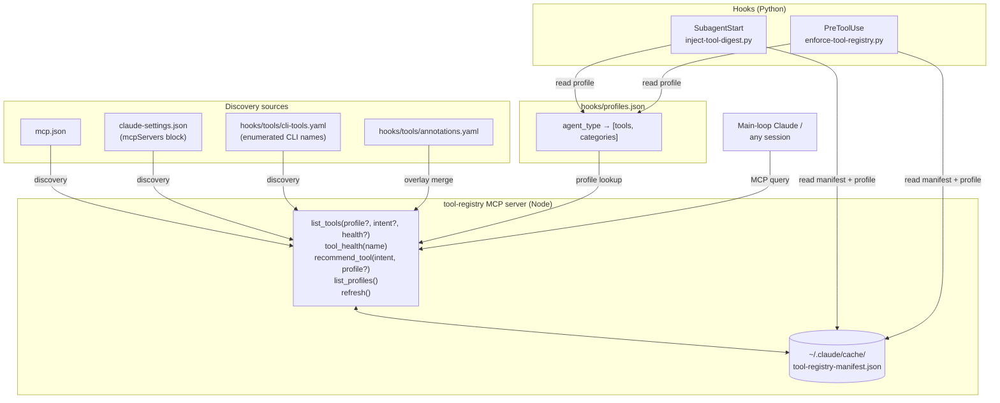

# feat: Materialised Tool Discovery — Implementation Plan

## Summary

Build a tool-registry layer for the `~/.dotfiles/ai/` Claude Code dotfiles repo: a Node-based `tool-registry` MCP server plus Python `SubagentStart` and `PreToolUse` hook integration that share one auto-introspected, profile-filtered manifest. The registry discovers tools by reading `mcp.json` + `claude-settings.json` and calling `tools/list` on each MCP server, plus `command -v` probes for CLI tools. Non-inferable metadata (categories, capability tags, per-category `prefer_over` chains) lives in a `hooks/tools/annotations.yaml` overlay. Profiles colocate with the existing guideline-injection mechanism via a parallel `hooks/profiles.json` file. The prototype slice covers exploration tools (`fff` MCP, `ast-grep`, `rg`, `fd`, `grep`, `find`, `turbo-rag` `semantic_search`); the design extends to future categories without registry-code changes.

---

## Problem Frame

Tool selection today is shaped by three context surfaces (eager-zone schemas, deferred-zone names, one-shot system-reminders). The deferred zone is a flat list with no capability or health metadata, and system-reminders never update after session start. Four frictions follow: silent mid-task tool failures, missed deferred tools, training-time priors overriding `AGENTS.md` (the LLM reaches for `grep` despite the fff-first rule), and context burned on wrong deferred-tool schemas. The existing `PreToolUse` hook (fff-vs-rg nudge, `hooks/enforce-tool-guidelines.sh`) and `SubagentStart` guideline injection (`hooks/inject-guidelines.py` reading `hooks/guidelines.json`) prove the substrate works; what is missing is a structured registry both consumers can read from. (see origin: `docs/brainstorms/2026-06-10-materialised-tool-discovery-requirements.md`)

---

## Key Technical Decisions

### KTD1. Profile file is a new `hooks/profiles.json`, separate from `hooks/guidelines.json`

Resolves origin "Resolve before planning" item (a). Profiles live in a parallel file (`hooks/profiles.json`) that mirrors the shape and loader idiom of `hooks/guidelines.json` but stays independent. Override comment is `<!-- tools: profile-name -->` or `<!-- tools: tool1,tool2,category1 -->`, distinct from the existing `<!-- inject: ... -->`.

Rationale: guideline slugs (prose snippets) and tool filters (name allowlists) have independent change cadences and unrelated content. Mixing them into one file couples otherwise-orthogonal concerns and forces the loader to handle two value types. The parallel-file approach lets each system evolve on its own timeline while reusing the same JSON shape, profile lookup semantics, and `<!-- prefix: ... -->` override idiom. Reviewers can read either file standalone.

Alternative considered: extend `guidelines.json` with a `tools` block per profile. Rejected because it merges a documentation-style file with a runtime-allowlist file, and the override-comment ambiguity (`<!-- inject: foo -->` — is `foo` a guideline or a tool?) costs more than the file-count savings.

### KTD2. Annotation overlay schema — open taxonomy, per-intent linear chains, declared overrideable fields

Resolves origin "Resolve before planning" item (b).

**Category taxonomy: open with a documented closed seed.** Seed categories: `search-content`, `find-files`, `semantic-search`, `git-state`, `list-dir`, `ast-search`. New categories may be introduced by adding annotation entries; the registry treats unknown categories as valid and emits them in `list_profiles()`/`list_tools()` output unchanged. Closed-set validation is rejected because it adds a registry-code-change cost to every new tool category, violating R15.

**`prefer_over` shape: per-intent (per-category) linear chains.** A single global linear chain conflates intents (`mcp__fff__grep` outranks `fd` for content search but not for file discovery). A pairwise preference graph is more expressive than needed and harder for humans to author. Per-category linear chains match how `AGENTS.md` already describes preferences. The decision is the schema *shape*; the canonical entry layout lives in [High-Level Technical Design § Manifest entry shape](#manifest-entry-shape).

**Overrideable fields:** the overlay may override `description`, `category`, `capability_tags`, `prefer_over`, `fallback_to`, `compose_with`. The overlay may NOT override `name`, `source` (introspected MCP server + tool name or CLI binary path), `schema` (introspected from `tools/list`), or `health` (runtime-computed). Override semantics: overlay value replaces auto-discovered value when both exist; auto-discovered value is used when overlay is silent.

**`compose_with` semantics.** A list of tool names (manifest keys) that commonly chain with this tool. Consumers (the digest hook, `recommend_tool`, any future router) treat the list as advisory hints — "if you used this tool, these are the natural next calls". Day-1 use is limited (one seeded example in U4 for `mcp__fff__find_files`); the field exists so that compose hints can be added incrementally without a schema change as multi-tool patterns emerge. An empty or missing `compose_with` is normal, not an error.

### KTD3. MCP server in Node, hooks in Python

The MCP (Model Context Protocol) server follows the existing `mcp-servers/obsidian-vault/` pattern: Node + `@modelcontextprotocol/sdk@0.5.0` stdio transport, `"type": "module"` (ES modules), Node 18+. The hooks follow the existing `hooks/inject-guidelines.py` pattern: Python script reading the manifest via filesystem cache (not via MCP). This mirrors what already works in the repo and avoids a process-spawn from the hook on every tool call.

**Dependency bootstrap.** Aligns with the repo's existing convention: `package.json` and `package-lock.json` are committed; `node_modules/` is gitignored by the repo's root `.gitignore`. A one-time `npm install` run from `mcp-servers/tool-registry/` is required after the dotfiles repo is cloned (or after `package-lock.json` changes). No `npm install` runs at session-start or at runtime — the "zero-install at runtime" promise is intact; the bootstrap is a post-clone, one-time step. The SDK version is pinned to `0.5.0` to track the existing server; bumps happen in lockstep.

### KTD4. Session-scoped manifest cache at `~/.claude/cache/tool-registry-manifest.json`

The registry builds the manifest once per session at `SessionStart` and writes it to `~/.claude/cache/tool-registry-manifest.json`. The MCP server reads/writes this file; the hooks read it directly (no MCP round-trip). `tool_health(name)` re-probes on demand and updates the cache entry. Cache scope = session: each `SessionStart` rebuilds. Out of scope (per origin scope boundary): mid-session health re-discovery, cross-session learning.

**Corruption recovery.** Manifest writes are atomic: write to `tool-registry-manifest.json.tmp`, fsync, rename to the final path. A partial-write at session-start time can never produce a half-parsed file on read. Schema-version mismatch in an existing cache file triggers a full rebuild rather than a stale read (corollary of the atomic-write rule — the rebuild itself is also atomic). `~/.claude/cache/` is created with `mkdir -p` by `refresh-tool-registry.sh` before the server spawns.

### KTD5. PreToolUse hook replaces `enforce-tool-guidelines.sh`, not extends

The existing `hooks/enforce-tool-guidelines.sh` hard-codes the fff > rg > grep + fd > find chain in bash. The new registry-driven hook subsumes it: read the manifest, look up the called tool's profile membership and `prefer_over` chain, emit the nudge. On registry-unhealthy (manifest missing/stale/unreadable), fall back to a small embedded copy of the current hard-coded chain so the user is never worse off than today.

**Intentionally-minimal fallback.** The embedded fallback prose is kept minimal (the same two chains the bash script encodes — fff > rg > grep, fd > find) precisely because drift between the embedded fallback and the canonical registry is acceptable when the registry is unhealthy. Anything richer creates a parallel source of truth.

**Deletion is gated on probation.** The swap happens in U9 (`claude-settings.json` points at the new hook). The actual `rm hooks/enforce-tool-guidelines.sh` happens in U10 after at least one full session of advisory-mode operation has shown no regressions in `~/.claude/logs/search-tool-audit.jsonl`. If the swap commit needs to be reverted, the old script is still on disk in that intermediate state.

---

## High-Level Technical Design

### Component topology



### Manifest entry shape

```yaml
# ~/.claude/cache/tool-registry-manifest.json (rendered as YAML for readability)
generated_at: 2026-06-10T14:00:00Z
schema_version: 1
tools:
  mcp__fff__grep:
    name: mcp__fff__grep
    source:
      kind: mcp
      server: fff
      tool: grep
    schema: { ... auto-discovered from tools/list ... }
    description: "Search file contents (frecency-ranked, .gitignore-aware)"
    category: [search-content]
    capability_tags: [content-search, frecency-ranked, gitignore-aware]
    prefer_over:
      search-content: [ast-grep, rg, grep]   # matches AGENTS.md canonical chain: fff > ast-grep > rg > grep
    compose_with: [Read, mcp__fff__record_access]
    health:
      state: healthy
      checked_at: 2026-06-10T14:00:00Z
      detail: "tools/list returned 7 tools"
  rg:
    name: rg
    source:
      kind: cli
      binary: /opt/homebrew/bin/rg
    schema: null
    description: "ripgrep - full-text search"
    category: [search-content]
    capability_tags: [content-search]
    prefer_over:
      search-content: [grep]
    health:
      state: healthy
      checked_at: 2026-06-10T14:00:00Z
```

### `recommend_tool` scoring (directional, not implementation specification)

```
score(tool, intent, profile):
  if tool not in profile.allowed: return -inf
  if tool.health != healthy:      return -inf
  base = jaccard(tool.capability_tags, intent.tags)
  rank_bonus = position_in_prefer_over_chain(tool, intent.category)
  return base + rank_bonus
```

---

## Output Structure

```text
hooks/
├── profiles.json                       # new: tool-profile catalog (KTD1)
├── tools/                              # new: registry inputs
│   ├── cli-tools.yaml                  # enumerated CLI tools to probe
│   └── annotations.yaml                # overlay (KTD2)
├── inject-tool-digest.py               # new: SubagentStart hook
├── enforce-tool-registry.py            # new: PreToolUse hook (replaces enforce-tool-guidelines.sh)
└── lib/
    └── tool_registry_client.py         # new: shared manifest reader

mcp-servers/
└── tool-registry/                      # new: Node MCP server
    ├── package.json
    ├── index.js
    ├── src/
    │   ├── discovery.js                # MCP introspection + CLI probe
    │   ├── manifest.js                 # cache read/write, overlay merge
    │   ├── profiles.js                 # profile lookup + filter
    │   ├── recommend.js                # scoring
    │   └── health.js                   # tools/list handshake, command -v
    └── tests/
        ├── discovery.test.js
        ├── manifest.test.js
        ├── profiles.test.js
        └── recommend.test.js

tests/                                  # new at repo root
└── hooks/
    ├── test_inject_tool_digest.py
    ├── test_enforce_tool_registry.py
    └── test_tool_registry_client.py

docs/
└── tool-registry.md                    # new: user-facing readme
```

The implementer may adjust naming inside `mcp-servers/tool-registry/src/` if a different decomposition reads better. Per-unit `**Files:**` sections are authoritative.

---

## Requirements Traceability

Each origin requirement (R1–R15) and acceptance example (AE1–AE5) maps to one or more implementation units below.

| Origin | Covered by |
| ------ | ---------- |
| R1 manifest entry shape | U2, U3 |
| R2 auto-discovery | U2, U3 |
| R3 overlay file | U3, U4 |
| R4 health state | U5 |
| R5 day-1 seed from AGENTS.md | U4 |
| R6 profile filter | U6 |
| R7 every agent type has a profile | U6 |
| R8 per-spawn override comment | U6, U8 |
| R9 MCP server surface | U7 |
| R10 list_tools args | U7 |
| R11 recommend_tool scoring | U7 |
| R12 SubagentStart digest | U8 |
| R13 PreToolUse enforcement | U9 |
| R14 new MCP server flows in | U2, U3 |
| R15 new category requires no registry code | KTD2 + U3 |
| R16 main-session profile | U6 (defines `session-default`), U9 (resolves it for non-subagent calls) |
| AE1 healthy MCP, profile match | U8, U9 |
| AE2 unhealthy MCP at session start | U5, U8, U9 |
| AE3 new MCP server appears | U2, U3 |
| AE4 per-spawn profile override | U6, U8 |
| AE5 wrong tool by training prior | U9 |

---

## Implementation Units

### U1. Scaffold `tool-registry` MCP server skeleton

**Goal:** Create the package layout and registration so the MCP server appears in `mcp.json` and starts cleanly with a stub `list_tools` that returns an empty array.

**Requirements:** R9 (partial — server is callable; tool implementations land in U7).

**Dependencies:** none.

**Files:**
- `mcp-servers/tool-registry/package.json` (create)
- `mcp-servers/tool-registry/index.js` (create — entry point)
- `mcp-servers/tool-registry/src/server.js` (create — `Server` instance + transport)
- `mcp.json` (modify — add `tool-registry` server entry)
- `claude-settings.json` (modify — add `mcp__tool-registry__*` to `permissions.allow`)
- `mcp-servers/tool-registry/tests/server.test.js` (create)

**Approach:** Mirror `mcp-servers/obsidian-vault/` shape, including `"type": "module"` in `package.json` and `@modelcontextprotocol/sdk@0.5.0` (pinned to match the existing server). Commit `package.json` + `package-lock.json` (per KTD3); `node_modules/` is gitignored. A one-time post-clone `npm install` from `mcp-servers/tool-registry/` is required — no `npm install` runs on `SessionStart` or at runtime. Use stdio transport. Declare four tool names (`list_tools`, `tool_health`, `recommend_tool`, `list_profiles`) plus the admin `refresh` tool with stub handlers returning empty/sentinel results. The `mcp.json` entry runs the server with `node mcp-servers/tool-registry/index.js <project-root>`, passing the absolute repo root as an argv positional. The server resolves the root in this order: (1) first non-flag argv after the script path; (2) `MCP_PROJECT_ROOT` environment variable; (3) hard error with a clear message — **never** falls back to `process.cwd()`, since Claude Code spawns MCP servers from arbitrary working directories. Matches the `mcp-servers/obsidian-vault/` precedent for argv-passed roots.

**Patterns to follow:** `mcp-servers/obsidian-vault/index.js` for transport setup, argv handling, and tool registration shape.

**Test scenarios:**
- Server starts and responds to `tools/list` over stdio with four tools.
- Each stub tool returns a structurally valid response without errors.
- Test expectation includes: invalid project root path produces a clear error rather than silent empty response.

**Verification:** A spawned Claude session that adds `tool-registry` to `mcp.json` sees `mcp__tool-registry__list_tools` etc. in the deferred-tool list; calling each returns the stub response.

---

### U2. Discovery — read `mcp.json` and `claude-settings.json`, call `tools/list` on each MCP server

**Goal:** Enumerate MCP-sourced tools by spawning each declared server and invoking `tools/list`. Produce one auto-discovered manifest entry per tool with `name`, `source`, `schema`, server-supplied `description`, and a `health` placeholder filled by U5.

**Requirements:** R1 (name, source, schema, description fields), R2 (auto-discovery from `mcp.json` + `claude-settings.json`), R14 (zero-code addition of new servers).

**Dependencies:** U1.

**Files:**
- `mcp-servers/tool-registry/src/discovery.js` (create — MCP-server enumeration)
- `mcp-servers/tool-registry/tests/discovery.test.js` (create)

**Approach:** Read both `mcp.json` and the `mcpServers` block of `claude-settings.json`; merge by server name (settings overrides repo when both define the same name — mirrors what Claude Code itself does). **Spawn all declared servers in parallel** (Promise.all-equivalent) with per-server 10s timeout and a global 15s discovery deadline. After the global deadline, any unfinished servers' tools are marked `health=timeout` and discovery returns. For each spawned server, perform the MCP handshake over stdio, call `tools/list`, then exit the child. Collect `{ name: "mcp__<server>__<tool>", source: { kind: "mcp", server, tool }, schema, description }`. Surface per-server failures in a `discovery_errors` field on the manifest (visible via `list_tools` for triage).

**Out of scope for v1 discovery:** plugin-registered MCP servers (e.g., the `claude_ai_*` set injected by the compound-engineering plugin) are not enumerated. The discovery sources are `mcp.json` + `claude-settings.json::mcpServers` only — both files the user owns directly. Plugin-side enumeration would require a third source (the plugin manifest format) and is deferred per origin scope (prototype slice covers exploration tools).

**Patterns to follow:** `mcp-servers/obsidian-vault/index.js` argv/env handling. The MCP client side uses `@modelcontextprotocol/sdk/client/index.js` with `StdioClientTransport`.

**Test scenarios:**
- Given a `mcp.json` with one stub MCP server, discovery returns its tools with correct `mcp__<server>__<tool>` naming.
- Given a server in `claude-settings.json` only (not `mcp.json`), discovery still includes it.
- Given the same server name in both files, the `claude-settings.json` definition wins.
- Given a server whose process exits before handshake, discovery records the error and continues to the next server.
- Given a server whose `tools/list` exceeds the timeout, discovery marks the server's tools `health=timeout` and continues.
- Edge: an MCP server whose env-substitution token (e.g., `${BETTERSTACK_API_TOKEN}`) is unset — discovery launches with the literal string and surfaces the unauth handshake error.

**Verification:** Run discovery against the repo's current `mcp.json` + `claude-settings.json`. Output includes entries for the real declared servers; no entries are silently dropped without an accompanying error record.

---

### U3. CLI discovery + overlay merge — produce the consolidated manifest

**Goal:** Probe CLI tools enumerated in `hooks/tools/cli-tools.yaml` via `command -v`, merge their entries with the MCP-sourced entries from U2, and apply the `hooks/tools/annotations.yaml` overlay per the KTD2 override rules. Write the consolidated manifest to `~/.claude/cache/tool-registry-manifest.json`.

**Requirements:** R1 (category, capability_tags, full entry), R2 (CLI enumeration), R3 (overlay file, missing-entry tolerance), R15 (new category needs only an annotation).

**Dependencies:** U2.

**Files:**
- `hooks/tools/cli-tools.yaml` (create — enumerated CLI names for the prototype slice)
- `hooks/tools/annotations.yaml` (create — empty seed; populated in U4)
- `mcp-servers/tool-registry/src/manifest.js` (create — cache read/write, overlay merge)
- `mcp-servers/tool-registry/tests/manifest.test.js` (create)

**Approach:** `cli-tools.yaml` is a flat list of CLI tool names. The seed slice matches the verb set already tracked by `hooks/audit-search-tools.sh` (the canonical inventory of CLI search/listing tools the repo nudges on): `[ast-grep, rg, fd, grep, find, ls, eza]` plus `git` (for the `git status` verb). For each, run `command -v <name>`; if a path returns, add `{ name, source: { kind: "cli", binary: <path> }, schema: null, description: null }`. Apply the overlay: for each manifest entry, look up `annotations[entry.name]`; for each KTD2-overrideable field present in the overlay, replace the auto-discovered value. Missing overlay entries are tolerated — the entry flows through with `category: []`, `capability_tags: []`, and `prefer_over: {}`.

**Atomic write.** The consolidated manifest is written to `~/.claude/cache/tool-registry-manifest.json.tmp`, fsynced, then renamed to `~/.claude/cache/tool-registry-manifest.json`. Reads never see a partial write. `schema_version: 1` and `generated_at` ISO-8601 timestamp are top-level keys. A schema-version mismatch on read triggers a full rebuild rather than a stale read.

**Patterns to follow:** schema-version field convention is new for this repo; mirror the simple `{ schema_version, generated_at, ... }` shape used by similar cache files in MCP ecosystem examples.

**Test scenarios:**
- Given a `cli-tools.yaml` with a tool that exists on PATH, the manifest includes it with `kind=cli` and a real binary path.
- Given a tool that does not exist on PATH, the manifest still includes it with `health=unhealthy` (set by U5) and `binary=null`.
- Given an overlay entry that overrides `description`, the manifest entry's `description` is the overlay value.
- Given an overlay entry that attempts to override `schema`, the merge ignores the override and the auto-discovered schema is preserved (overrideability is enforced in code, not by convention).
- Given an overlay entry for a tool that does not exist in discovery, the entry is silently dropped (the overlay does not invent tools).
- Edge: malformed YAML in `annotations.yaml` produces a clear error naming the offending key, not a silent fallback.
- Edge: `schema_version` mismatch in an existing cache file triggers a rebuild rather than a stale read.

**Verification:** Inspect `~/.claude/cache/tool-registry-manifest.json` after a session start; it contains entries for the prototype slice (`mcp__fff__*`, `ast-grep`, `rg`, `fd`, `grep`, `find`, `mcp__turbo-rag__semantic_search`) with the right `category`, `capability_tags`, and `prefer_over` shape after U4 lands.

---

### U4. Day-1 seed — extract `prefer_over` / `fallback_to` from `AGENTS.md` into the annotation overlay

**Goal:** Populate `hooks/tools/annotations.yaml` with category assignments, capability tags, and per-intent `prefer_over` chains for the prototype slice, derived from the `AGENTS.md` "Command Tool Order" and "Tooling Preferences" sections.

**Requirements:** R5 (AGENTS.md is the day-1 source).

**Dependencies:** U3.

**Files:**
- `hooks/tools/annotations.yaml` (modify — populate with prototype-slice entries)
- `hooks/tools/SEED_NOTES.md` (create — short doc of which AGENTS.md lines map to which annotation; manual one-shot record)

**Approach:** Manual one-shot transcription per origin-doc "Deferred to planning" note 1 (`AGENTS.md` seed mechanism is a planning-time choice). Walk the `AGENTS.md` Command Tool Order list and produce annotations for each prototype-slice tool:

```yaml
mcp__fff__grep:
  category: [search-content]
  capability_tags: [content-search, frecency-ranked, gitignore-aware, indexed]
  prefer_over:
    search-content: [ast-grep, rg, grep]

mcp__fff__find_files:
  category: [find-files]
  capability_tags: [file-discovery, frecency-ranked, gitignore-aware, indexed]
  prefer_over:
    find-files: [fd, find]
  compose_with: [Read, mcp__fff__record_access]   # day-1 seed; new compose_with entries land as patterns emerge (KTD2)

ast-grep:
  category: [search-content, ast-search]
  capability_tags: [structural-search, ast-aware]
  prefer_over:
    search-content: [rg, grep]

rg:
  category: [search-content]
  capability_tags: [content-search, gitignore-aware]
  prefer_over:
    search-content: [grep]

fd:
  category: [find-files]
  capability_tags: [file-discovery, gitignore-aware]
  prefer_over:
    find-files: [find]

grep:
  category: [search-content]
  capability_tags: [content-search, last-resort]

find:
  category: [find-files]
  capability_tags: [file-discovery, last-resort]

ls:
  category: [list-dir]
  capability_tags: [directory-listing]
  prefer_over:
    list-dir: []

eza:
  category: [list-dir]
  capability_tags: [directory-listing, colorized]
  prefer_over:
    list-dir: [ls]

git-status:
  category: [git-state]
  capability_tags: [git-state]

mcp__fff__list_directories:
  category: [list-dir]
  capability_tags: [directory-listing, frecency-ranked, indexed]
  prefer_over:
    list-dir: [eza, ls]

mcp__fff__get_git_status:
  category: [git-state]
  capability_tags: [git-state, frecency-enriched, indexed]
  prefer_over:
    git-state: [git-status]

mcp__turbo-rag__semantic_search:
  category: [semantic-search]
  capability_tags: [semantic, embedding-based]
```

After this lands, the registry becomes the canonical source for `prefer_over` chains. The `AGENTS.md` prose stays as human-facing documentation; future updates flow through the overlay file. The overlay's tool-name set aligns with the verb set tracked by `hooks/audit-search-tools.sh`, so the audit log and the registry agree on which calls to compare.

**Test scenarios:**
- Lint-style: the overlay parses as YAML and every tool's `prefer_over` references real tool names enumerated elsewhere in the overlay or the CLI list (no typos).
- Manifest assembly using this overlay produces the expected `prefer_over` chains in `~/.claude/cache/tool-registry-manifest.json` for the prototype slice.
- Test expectation: none for `SEED_NOTES.md` itself — it is documentation, not behavior.

**Verification:** `recommend_tool(intent={category: search-content})` returns `mcp__fff__grep` first when healthy; returns `ast-grep` next; falls back to `rg` then `grep`. (Exercised in U7's tests.)

---

### U5. Health resolution — handshake checks for MCP tools, `command -v` for CLI tools

**Goal:** Compute `health` for every manifest entry. MCP tool health = the parent server's `tools/list` handshake state from U2 propagated to each of its tools. CLI tool health = whether `command -v` returned a path. Expose `tool_health(name)` as an on-demand re-probe.

**Requirements:** R4.

**Dependencies:** U3.

**Files:**
- `mcp-servers/tool-registry/src/health.js` (create — propagation logic + re-probe)
- `mcp-servers/tool-registry/tests/health.test.js` (create)

**Approach:** Health states: `healthy`, `unhealthy`, `timeout`, `unknown`. At manifest build time, every tool inherits its parent server's state (MCP) or its `command -v` result (CLI). `tool_health(name)` re-runs the appropriate probe for that single tool/server, updates the cache entry's `state` and `checked_at`, and returns. The hooks read the cached state (no MCP round-trip); the MCP `tool_health` tool is for on-demand LLM use.

Auth-gated MCPs (per origin assumption — `claude.ai_*` OAuth set) require the handshake-only probe to be sufficient. If a server returns an empty `tools/list` response without an explicit error, treat it as `unhealthy` with `detail: "tools/list returned empty"`. Document this in `docs/tool-registry.md` (U10) as a known boundary.

**Test scenarios:**
- Healthy CLI: `command -v rg` returns a path → `health.state == healthy`.
- Unhealthy CLI: `command -v doesnotexist` returns non-zero → `health.state == unhealthy`.
- Healthy MCP: `tools/list` returns ≥1 tool → all of that server's tools are `healthy`.
- Unhealthy MCP: server process exits with non-zero before handshake → all tools `unhealthy` with `detail` capturing exit code.
- Timeout MCP: discovery deadline reached → all tools `timeout`.
- Empty-response MCP: `tools/list` returns 0 tools → all tools `unhealthy` with `detail: "tools/list returned empty"`.
- Re-probe: `tool_health(name)` on a previously-unhealthy CLI that has since been installed returns `healthy` and updates the cache.
- Covers AE2: unhealthy MCP at session start is correctly marked.

**Verification:** In a session where `turbo-rag` is intentionally taken offline, the manifest shows `mcp__turbo-rag__semantic_search` as `unhealthy` with a meaningful `detail`.

---

### U6. Profiles file + loader + override-comment parser

**Goal:** Define `hooks/profiles.json` with one profile per agent type, plus the shared loader/parser that resolves a profile's allowed tool set (categories ∪ explicit names) and parses `<!-- tools: ... -->` override comments.

**Requirements:** R6 (profile = filter referencing categories AND names), R7 (every agent type has an entry), R8 (override-comment idiom), R16 (main-session profile shape).

**Dependencies:** U3 (categories must be defined before profiles can reference them), U4 (the seeded annotations populate the manifest entries the verification step asserts against — without U4, `resolve_profile("code-explorer", …)` returns an empty set rather than the expected `{mcp__fff__grep, ast-grep, rg, …}`).

**Files:**
- `hooks/profiles.json` (create — agent-type → profile entries)
- `hooks/lib/__init__.py` (create — package marker)
- `hooks/lib/tool_registry_client.py` (create — shared Python manifest+profile reader)
- `mcp-servers/tool-registry/src/profiles.js` (create — Node-side profile reader)
- `mcp-servers/tool-registry/tests/profiles.test.js` (create)
- `tests/hooks/test_tool_registry_client.py` (create)

**Approach:** `hooks/profiles.json` shape mirrors the keys of `hooks/guidelines.json` profiles (which is the authoritative inventory of `subagent_type` strings Claude Code emits) so the two parallel-file systems agree on agent names:

```json
{
  "version": 1,
  "profiles": {
    "default":               { "tools": [], "categories": ["search-content", "find-files", "git-state", "list-dir"] },
    "session-default":       { "tools": [], "categories": ["search-content", "find-files", "git-state", "list-dir", "ast-search", "semantic-search"] },
    "claude":                { "tools": [], "categories": ["search-content", "find-files", "git-state", "list-dir"] },
    "general-purpose":       { "tools": [], "categories": ["search-content", "find-files", "git-state", "list-dir"] },
    "code-explorer":         { "tools": [], "categories": ["search-content", "find-files", "ast-search"] },
    "code-architect":        { "tools": [], "categories": ["search-content", "find-files"] },
    "code-reviewer":         { "tools": [], "categories": ["search-content", "find-files", "ast-search"] },
    "code-refiner":          { "tools": [], "categories": ["search-content", "find-files"] },
    "architecture-reviewer": { "tools": [], "categories": ["search-content", "find-files", "ast-search"] },
    "plan-refiner":          { "tools": [], "categories": ["search-content", "find-files"] },
    "documentation-refiner": { "tools": [], "categories": ["search-content"] },
    "skeptic":               { "tools": [], "categories": ["search-content"] },
    "Explore":               { "tools": [], "categories": ["search-content", "find-files", "ast-search", "list-dir"] },
    "Plan":                  { "tools": [], "categories": ["search-content", "find-files"] }
  }
}
```

Profile catalog covers every agent in `agents/` that has a corresponding entry in `hooks/guidelines.json` (per R7). Agents present on disk but absent from `guidelines.json` (`design-refiner`, `pr-comment-reviewer`, `committer`, `pr-creator` — and any future additions) fall through to the `default` profile; document this in `docs/tool-registry.md`. `session-default` is the main-session (non-subagent) profile referenced by U9 — it ships with the broad category set because the main loop's tool mix is unbounded; narrow over time if telemetry shows specific tools should drop.

The union of `tools` and `categories` defines the allowed set. Override comment is `<!-- tools: profile-name -->` (replaces the agent type's default profile) or `<!-- tools: tool1,category1,tool2 -->` (uses an ad-hoc profile composed of the listed items). The override-comment parser regex is `<!--\s*tools:\s*([^>]+?)\s*-->` (case-insensitive), mirroring the `inject:` regex in `hooks/inject-guidelines.py`. The two prefixes (`inject:` and `tools:`) are independent — a prompt may carry both and both take effect.

The shared Python client (`hooks/lib/tool_registry_client.py`) exposes:

```python
def load_manifest() -> dict          # reads cache, returns parsed dict
def load_profiles() -> dict           # reads hooks/profiles.json
def resolve_profile(name: str, profiles: dict) -> set[str]   # returns the allowed tool-name set
def parse_override(prompt: str) -> list[str] | None          # returns override list or None
```

**Patterns to follow:** `hooks/inject-guidelines.py` for regex idiom (`<!--\s*inject:...-->` is the precedent), JSON profile file shape, and the explicit/profile/default resolution order.

**Test scenarios:**
- Resolving the `code-explorer` profile returns the union of its category-allowed tools and explicit tool names from the manifest.
- An override `<!-- tools: documentation-refiner -->` substitutes the named profile for the spawning agent's default.
- An override `<!-- tools: mcp__fff__grep,find-files -->` produces the union of the named tool plus the named category's tools.
- An override comment with whitespace/newlines (`<!-- tools:\n  mcp__fff__grep,\n  find-files\n-->`) parses correctly.
- Two override comments in one prompt: only the first is honored (matches `inject-guidelines.py` behavior).
- Co-presence: a prompt carrying both `<!-- inject: tool-hierarchy -->` and `<!-- tools: code-explorer -->` produces both effects independently — `inject-guidelines.py` honors `inject:`, `inject-tool-digest.py` honors `tools:`.
- Unknown profile name in override → empty allowed set; caller surfaces a warning (no crash).
- An unknown `subagent_type` (an agent on disk without a `profiles.json` entry, e.g., `design-refiner`) falls through to the `default` profile.
- Profile referencing a category with no tools yet → empty allowed set, not an error.
- Covers AE4: per-spawn override merges/replaces correctly.

**Verification:** From a Python REPL, `resolve_profile("code-explorer", load_profiles())` returns a set including `mcp__fff__grep`, `ast-grep`, and `rg` but excluding `mcp__turbo-rag__semantic_search`.

---

### U7. MCP tool surface — `list_tools`, `tool_health`, `recommend_tool`, `list_profiles`, `refresh`

**Goal:** Implement the four MCP tool handlers per origin R9–R11, plus a `refresh` admin tool that rebuilds the manifest cache without restarting the session.

**Requirements:** R9, R10, R11.

**Plan-added beyond origin R9.** `refresh()` extends the origin's enumerated MCP surface (`list_tools`, `tool_health`, `recommend_tool`, `list_profiles`). Rationale: ad-hoc cache rebuilds without a session restart are operationally necessary (a newly-installed CLI, a previously-down MCP that came back, an annotation overlay edit). The alternative — wait for the next `SessionStart` — is acceptable for most cases but blocks the obvious "I just fixed it, re-probe now" workflow. The tool is admin-shaped (no profile filtering, no intent argument) and returns a summary; see test scenarios. If the brainstorm doc is revisited, consider promoting `refresh` to a formal R-level requirement.

**Dependencies:** U3, U5, U6.

**Files:**
- `mcp-servers/tool-registry/src/recommend.js` (create — scoring per HTD pseudo-code)
- `mcp-servers/tool-registry/src/server.js` (modify — wire real handlers replacing U1 stubs)
- `mcp-servers/tool-registry/tests/recommend.test.js` (create)
- `mcp-servers/tool-registry/tests/server.test.js` (modify — replace stub-response tests with real-handler tests)

**Approach:** All four query tools read from the cached manifest + profiles file; only `tool_health` and `refresh` mutate state. `list_tools` filters by the supplied arguments (no filtering when arguments are absent = full healthy set, per origin R10 default-behavior note — clarify with `health=true` as the default so the no-arg call returns healthy tools only; expose `health=false` to surface the full set including unhealthy for triage). `recommend_tool` scoring follows HTD pseudo-code: zero out non-allowed and non-healthy tools, score by Jaccard overlap of `capability_tags` with the intent's tag set, add rank bonus from `prefer_over` chain position for the intent's category, return the highest-scored tool. Ties broken by the tool's position in its category's `prefer_over` chain.

**Test scenarios:**
- `list_tools()` with no args returns the full healthy set.
- `list_tools(profile="code-explorer")` restricts to that profile's allowed-and-healthy tools.
- `list_tools(intent={category: "search-content"})` returns tools matching that category, ordered by `prefer_over` position.
- `list_tools(health=false)` includes unhealthy tools with their failure detail (for triage).
- `tool_health("mcp__fff__grep")` re-probes and returns the updated state.
- `recommend_tool(intent={category: "search-content"})` returns `mcp__fff__grep` when healthy.
- `recommend_tool(intent={category: "search-content"})` returns `ast-grep` when `mcp__fff__grep` is unhealthy.
- `recommend_tool(intent={category: "search-content"}, profile="documentation-refiner")` returns the highest-scored tool inside that profile's allowed set.
- `recommend_tool` with an intent that matches no allowed-and-healthy tool returns `null` (not an error).
- `list_profiles()` returns all profile names plus their resolved allowed-tool sets.
- `refresh()` rebuilds the cache and returns a summary `{ tools_count, healthy_count, errors_count }`.
- Covers AE1, AE2 (recommendation falls back when MCP unhealthy).

**Verification:** Manual session — load the schemas, call `mcp__tool-registry__list_tools(profile="code-explorer")`, confirm output matches the resolved profile.

---

### U8. SubagentStart hook — inject profile-filtered tool digest

**Goal:** Replace the existing tool-hierarchy guideline injection's static prose (for sub-agents whose profile filters tools) with a dynamic per-spawn digest of profile-allowed-and-healthy tools, read from the manifest cache.

**Requirements:** R12, R8.

**Dependencies:** U6.

**Files:**
- `hooks/inject-tool-digest.py` (create — new SubagentStart hook)
- `claude-settings.json` (modify — add `inject-tool-digest.py` to `SubagentStart` hooks)
- `tests/hooks/test_inject_tool_digest.py` (create)

**Approach:** Run alongside the existing `inject-guidelines.py` — both fire on `SubagentStart`. The new hook reads `subagent_type` from the input, parses any `<!-- tools: ... -->` override comment, resolves the profile via `tool_registry_client.resolve_profile`, filters to the healthy subset, and emits an `additionalContext` block grouped by category with `prefer_over` ordering visible:

```
## Tool Digest (profile: code-explorer)

### search-content (prefer in this order)
- mcp__fff__grep  — Search file contents (frecency-ranked)
- ast-grep        — Structural code search
- rg              — ripgrep full-text

### find-files (prefer in this order)
- mcp__fff__find_files
- fd

### ast-search
- ast-grep
```

If the manifest cache is missing or stale, the hook exits silently with a soft-fail message to stderr (no `additionalContext`) — the agent still functions, just without the digest.

**Coexistence with the `tool-hierarchy` guideline slug.** `inject-guidelines.py` still injects the `tool-hierarchy.txt` prose for profiles whose `guidelines.json` entry includes that slug. The new digest *also* lands in those agents' context. v1 accepts the duplication: `tool-hierarchy.txt` is a prose summary of the principle; the digest is the live, profile-filtered, health-aware view. Consolidating the slug into a "see digest" pointer is deferred (see Deferred to Follow-Up Work).

**Patterns to follow:** `hooks/inject-guidelines.py` for stdin parsing, JSON output shape, and silent-exit-on-missing-config behavior.

**Test scenarios:**
- Spawning a `code-explorer` sub-agent: digest contains `mcp__fff__grep`, `ast-grep`, `rg` under `search-content`.
- Spawning with `<!-- tools: documentation-refiner -->`: digest reflects the override profile, not `code-explorer`'s default.
- Spawning with `<!-- tools: mcp__fff__grep,find-files -->`: digest contains only the named tool + the named category's tools.
- Unhealthy `mcp__turbo-rag__semantic_search`: it is absent from any profile that would otherwise include it.
- Missing manifest cache: the hook exits 0 without emitting `additionalContext` and without raising.
- Unknown `subagent_type`: falls back to the `default` profile (mirrors `inject-guidelines.py`).
- Covers AE1, AE4.

**Verification:** Spawn a `code-explorer` agent and confirm the injected digest is present in its system reminders; spawn one with `<!-- tools: documentation-refiner -->` and confirm the digest reflects the override.

---

### U9. PreToolUse hook — registry-driven nudge / block (swaps `enforce-tool-guidelines.sh`)

**Goal:** Add a Python hook that consults the registry manifest on every tool call and swap `claude-settings.json` to point at it instead of `enforce-tool-guidelines.sh`. If the called tool is outside the active profile or known-unhealthy, emit a nudge naming the registry-derived alternative. The old bash script stays on disk until U10's probation-gated cleanup so the swap commit is trivially reversible.

**Requirements:** R13, AE5.

**Dependencies:** U6, U7 (the manifest must be populated before this hook is useful).

**Files:**
- `hooks/enforce-tool-registry.py` (create — new PreToolUse hook)
- `claude-settings.json` (modify — swap `enforce-tool-guidelines.sh` for `enforce-tool-registry.py` in the `PreToolUse` Bash matcher and add an `mcp__.*` matcher)
- `tests/hooks/test_enforce_tool_registry.py` (create)

**Approach:** The hook receives `tool_name` and (for Bash) `tool_input.command`. For Bash, parse the first verb using the same regex set already in `hooks/audit-search-tools.sh` (which is the canonical verb inventory for the repo): `(^|[|;&[:space:]]+)(rg|fd|grep|find|ls|eza|git[[:space:]]+status)([[:space:]]|$)`. Reusing the audit-log regex guarantees the nudge surface and the audit log stay in lockstep. Map the matched verb to a manifest tool name. For MCP calls, the `tool_name` is already the manifest key. Look up the tool's `prefer_over` chain for its primary category; emit a nudge naming the higher-ranked alternatives that are currently healthy and in-profile.

**Active profile resolution.** The hook determines the active profile in this order:

1. If `hook_input.tool_input.subagent_type` is present (subagent context), use that profile name.
2. Otherwise use the `session-default` profile defined in `profiles.json`.
3. If `session-default` is missing, fall back to `default`.

**Advisory-mode safety claim.** v1 always returns `permissionDecision: allow`. A bug in `enforce-tool-registry.py` produces nudge noise at worst, never blocks a tool call. Block-mode is forward-compatibility infrastructure only in v1.

On registry-unhealthy (manifest missing/unparseable), fall back to a small embedded copy of the current hard-coded chain (fff > rg > grep, fd > find) so behavior never regresses. The embedded fallback is intentionally minimal (per KTD5) — the canonical preference data lives in the registry. Emit `additionalContext` only. Add a `block_unhealthy: false` flag in `profiles.json` (per-profile) as a forward-compatibility hook for AE2's "blocks the call" behavior, defaulting to false; flip to true for the `default` profile once nudge mode has run for a session and proven stable in `~/.claude/logs/search-tool-audit.jsonl`.

**Latency budget.** The hook runs on every Bash and `mcp__*` call. Budget: cache-read (≤5ms) + JSON parse (≤10ms for a ~50-tool manifest) + lookup (≤1ms) + emit (≤1ms) = ≤20ms p95, well under the existing `claude-settings.json` 5s timeout. The Python interpreter cold-start cost dominates (~50-100ms). If telemetry shows aggregate budget breached, a circuit-breaker (skip the hook for N calls after timeout) is a Deferred Follow-Up.

**Patterns to follow:** `hooks/enforce-tool-guidelines.sh` for hook output shape (`hookSpecificOutput.permissionDecision: allow` + `additionalContext`). `hooks/audit-search-tools.sh` for matcher list (Bash, mcp__fff__*) and command-verb regexes.

**Test scenarios:**
- Calling `grep -r pattern .` from a profile that allows `mcp__fff__grep`: `additionalContext` names `mcp__fff__grep`, `ast-grep`, `rg` in `prefer_over` order.
- Calling `mcp__fff__grep` from the same profile: no nudge (the call is in-profile and healthy).
- Calling `mcp__turbo-rag__semantic_search` when it is unhealthy: `additionalContext` reports the unhealthy state and names the nearest healthy alternative.
- Calling a tool outside the active profile (e.g., `mcp__chartmogul__*` from `documentation-refiner`): nudge names the in-profile alternative if any.
- Calling a tool with `block_unhealthy: true` and `health=unhealthy`: returns `permissionDecision: deny` with a clear `additionalContext` message — exercises the AE2 block path.
- Registry cache missing: hook falls back to embedded hard-coded chain, still emits the fff-first nudge.
- Edge: Bash command containing a search verb inside a quoted string (`echo "grep this"`) — the regex must match only standalone verbs at command boundaries.
- Edge: piped command (`cat foo | grep bar`) — the verb is detected and a nudge fires.
- Edge: subshell (`$(grep foo bar)`) — verb is detected.
- Covers AE2, AE5.

**Verification:** Issue `grep -r pattern .` in a real session; confirm the nudge fires with manifest-derived alternatives. Remove `~/.claude/cache/tool-registry-manifest.json`; confirm the fallback nudge still fires.

---

### U10. SessionStart wiring + user-facing readme + probation-gated cleanup

**Goal:** Wire the registry to rebuild at `SessionStart` (so the cache is fresh per session), document the system in `docs/tool-registry.md`, point `AGENTS.md` at the registry as the canonical `prefer_over` source, and (after a probation period) remove `hooks/enforce-tool-guidelines.sh`.

**Requirements:** R2 (refresh trigger), R14 (zero-code addition workflow documented).

**Dependencies:** U1–U9.

**Files:**
- `hooks/refresh-tool-registry.sh` (create — spawns the MCP server with a `--refresh-and-exit` flag)
- `mcp-servers/tool-registry/index.js` (modify — accept `--refresh-and-exit` flag)
- `claude-settings.json` (modify — add `refresh-tool-registry.sh` to `SessionStart` hooks *after* `preload-fff-tools.sh`, not replacing it)
- `docs/tool-registry.md` (create — user-facing readme)
- `AGENTS.md` (modify — add a short pointer to the registry; do not remove the existing tool-hierarchy prose, which remains human-facing documentation)
- `hooks/enforce-tool-guidelines.sh` (delete only after probation — see Approach)
- `hooks/README.md` (modify — note the new hooks)

**Approach:** The `SessionStart` hook runs `mkdir -p ~/.claude/cache/` then spawns the MCP server with `--refresh-and-exit`, which runs discovery, writes the cache (atomically per KTD4), and exits 0. Timeout: 15s (covers parallel MCP server cold starts per U2's deadline). On timeout or failure, exit 0 silently — downstream hooks fall back to embedded behavior. A sentinel `last_success: <iso8601>` in the manifest lets `tool_health()` detect whole-discovery failures (cache exists but is stale or empty).

**Hook coexistence at `SessionStart`.** Three hooks run in order: `load_vault_context.py` → `preload-fff-tools.sh` (existing — injects the ToolSearch-priming reminder) → `refresh-tool-registry.sh` (new — builds the manifest). `preload-fff-tools.sh` is *not* removed: it solves a UX problem (priming the LLM to call `ToolSearch` early) that the registry doesn't address. The two are independent.

**Probation-gated cleanup of `enforce-tool-guidelines.sh`.** The swap in U9 lands the new Python hook and points `claude-settings.json` at it. The old bash script stays on disk through that commit. After at least one full session in advisory mode has produced a clean `~/.claude/logs/search-tool-audit.jsonl` (no registry-vs-behavior mismatches), the U10 cleanup commit deletes `hooks/enforce-tool-guidelines.sh`. If a regression surfaces during probation, reverting U9's `claude-settings.json` edit restores the old behavior in a single commit.

**`docs/tool-registry.md` contents.** Documents the manifest shape, profile catalog (referencing `guidelines.json` as the agent-name source of truth), overlay schema (referencing KTD2), how to add a new MCP server (zero code), how to add a new category (overlay-only), the v1 scope boundary (plugin-registered MCP servers not enumerated), and the empty-`tools/list` health convention. The `AGENTS.md` change is a one-paragraph addition pointing at `docs/tool-registry.md`; the existing tool-hierarchy table stays put. v1 accepts the triple-source state (AGENTS.md prose, `tool-hierarchy.txt` guideline slug, `annotations.yaml` overlay); consolidation is Deferred Follow-Up.

**Test scenarios:**
- `SessionStart` builds the cache within 15s for the current repo's MCP set.
- Adding a new server to `mcp.json` and starting a new session causes it to appear in `~/.claude/cache/tool-registry-manifest.json` without further user action — covers AE3.
- Adding a new category to `annotations.yaml` (e.g., `slack-search`) and a profile reference to it surfaces tools tagged with that category in the next session's digest — covers R15.
- Removing `hooks/enforce-tool-guidelines.sh` does not break any other hook (it is only referenced from `claude-settings.json`, which is updated in this unit).
- Test expectation for `docs/tool-registry.md`: none — documentation.

**Verification:** Full end-to-end smoke: start a new session, observe `~/.claude/cache/tool-registry-manifest.json` populated, spawn a `code-explorer` agent and confirm the injected digest, issue `grep -r foo .` and confirm the nudge.

---

## Scope Boundaries

Carried verbatim from origin where the origin made the call; plan-local follow-ups separated.

### Deferred for later (carried from origin)

- Approach C (LLM-curated catalog) — graduation path, not v1.
- Tool categories beyond exploration (Slack search, Atlassian, Notion, Figma, …) — follow once the mechanism is validated against the prototype slice.
- Mid-session health re-discovery — health is captured at `SessionStart`, re-resolvable on demand via `tool_health()` only.
- Credential / auth recovery — the registry reports unhealthy + failure mode; no re-authentication, no OAuth flow trigger.
- Cross-session learning — the registry is stateless per session.

### Deferred to Follow-Up Work (plan-local)

- Block-mode enforcement for unhealthy MCPs (`block_unhealthy: true` default) — ships in v1 as opt-in per profile (KTD5); the per-profile flip is gated on origin AE2's graduation contract (≥50-session volume, ≤2% false-positive precision, ≥1 validated steer). Audit-log aggregation surfacing those three signals per profile is the follow-up work; flipping itself is a human edit to `profiles.json`.
- Slimming `AGENTS.md`'s tool-hierarchy prose to a registry pointer — keep the table in v1 (registry is the canonical source for behavior; the table stays for humans). Consolidation is a separate cleanup PR.
- Consolidating the `tool-hierarchy.txt` guideline slug into a "see digest" pointer — v1 accepts the digest-vs-slug duplication for sub-agents whose profile includes the slug. Cleanup happens once the digest has proven sufficient.
- `recommend_tool` intent inference from free-text descriptions — v1 takes a structured `intent={category, tags?}` argument; mapping prose to intents is a v2 concern.
- PreToolUse circuit-breaker for sustained latency breaches — v1 has no auto-skip; rely on the 5s hook timeout in `claude-settings.json` as the backstop. Add a circuit-breaker if `enforce-tool-registry.py` is observed to exceed the 50ms p95 budget.
- Enumerating plugin-registered MCP servers (the `claude_ai_*` set) — v1 reads only `mcp.json` + `claude-settings.json::mcpServers`. Extending discovery to plugin manifests is deferred until non-prototype-slice tool categories are needed.
- `recommend_tool` tie-break rule needs formal review if a new search category with overlapping `capability_tags` is added — current implementation uses chain-length as the rank proxy and breaks ties by preferring the shorter-chain (higher-evidence) tool. Documented inline at `mcp-servers/tool-registry/src/recommend.js`. Works for the current prototype slice because chains are strictly hierarchical and ties are rare; revisit when a new category introduces multiple tools with identical capability-tag sets.

---

## Open Questions

- **Block-mode rollout cadence.** Resolved by the origin's AE2 graduation contract: per-profile flip from `block_unhealthy: false` → `true` requires **all three** of (a) ≥50 sessions of nudge-mode evidence with the profile active, (b) false-positive rate ≤2% over that window, (c) at least one validated end-to-end nudge-steered-to-healthy-alternative case in `~/.claude/logs/search-tool-audit.jsonl`. The flip is human-reviewed per profile, not automated. Execution-time work remaining: build the audit-log aggregation that surfaces the three signals per profile (deferred to follow-up, not v1).
- **Plugin-registered MCP server enumeration.** v1 deliberately under-reports by reading only `mcp.json` + `claude-settings.json::mcpServers` (the user-owned files). The `claude_ai_*` set and any other plugin-injected servers are absent from the manifest. Open: is this acceptable indefinitely, or should v2 add a third discovery source? Deferred because the prototype slice has no plugin-registered tools.

---

## System-Wide Impact

- **`claude-settings.json`** gains three hook entries and one MCP-tool permission. The file's existing hook order matters: `SessionStart` runs `obsidian-second-brain/hooks/load_vault_context.py` → `preload-fff-tools.sh` → `refresh-tool-registry.sh` (new); `PreToolUse` swaps `enforce-tool-guidelines.sh` for `enforce-tool-registry.py`; `SubagentStart` adds `inject-tool-digest.py` alongside `inject-guidelines.py`.
- **`mcp.json`** gains the `tool-registry` server entry.
- **Existing hooks** — `audit-search-tools.sh` continues to log tool calls (now including `mcp__tool-registry__*`); its log feeds the eventual block-mode rollout decision and the U10 probation gate for deleting the old bash script. `inject-guidelines.py` is unchanged but now lives next to `inject-tool-digest.py` and shares the `<!-- prefix: ... -->` idiom space — the two prefixes (`inject:` and `tools:`) are independent.
- **PreToolUse latency budget** — the new hook fires on every Bash and `mcp__*` call. Budget: ≤20ms steady-state (cache read + JSON parse + lookup) plus ~50-100ms Python interpreter cold-start, well under the existing 5s hook timeout in `claude-settings.json`. The current bash hook is sub-100ms total; the Python successor is comparable.
- **`AGENTS.md` consumers** — agents that read `AGENTS.md` for the tool hierarchy continue to do so; the registry is the canonical source for behavior, but the prose stays as human-facing documentation in v1. Triple-source state (AGENTS.md prose, `tool-hierarchy.txt` slug, `annotations.yaml` overlay) is accepted for v1; consolidation is Deferred Follow-Up.
- **Cache directory** — `~/.claude/cache/` is created with `mkdir -p` by `refresh-tool-registry.sh` before the server spawns; no other component needs to ensure its presence. The cache file is regenerated each session via atomic write (temp + rename per KTD4); deleting it triggers a fallback to embedded behavior, not a crash. If the directory is unwritable (read-only mount, permission issue), `refresh-tool-registry.sh` exits 0 silently and the embedded fallback runs for the whole session.

---

## Risks & Dependencies

- **Risk: MCP server cold-start latency at scale.** Discovery spawns every declared MCP server. A serial spawn of the 6 servers in `mcp.json` plus any in `claude-settings.json::mcpServers` would easily blow the 15s `SessionStart` budget if any one server is slow. Mitigation: U2 spawns all servers in parallel with a per-server 10s timeout and a global 15s deadline; unfinished servers' tools are marked `health=timeout`. Re-runnable via `tool_health(name)` for ad-hoc recovery.
- **Risk: Auth-gated MCPs return misleading-success responses.** Per origin assumption, handshake-only health may be insufficient if a server accepts the handshake but exposes no usable tools without auth. Mitigation: U5's "empty `tools/list` → unhealthy" rule handles the common case; document the boundary in `docs/tool-registry.md`.
- **Risk: Stale cache.** A `SessionStart`-built cache may not reflect mid-session changes (a server starts working, a CLI is installed). Mitigation: `tool_health(name)` re-probes; `mcp__tool-registry__refresh()` rebuilds the whole cache without restarting the session. Documented in `docs/tool-registry.md` as the expected workflow.
- **Risk: PreToolUse hook regression breaks tool-selection nudges.** If `enforce-tool-registry.py` has a bug, every Bash invocation could spam noise. Mitigation: v1 always returns `permissionDecision: allow` (advisory-mode safety claim in U9 approach) — a bug produces noise, never blocks. Registry-unhealthy fallback runs the embedded hard-coded chain matching today's behavior. Test scenarios in U9 cover all fallback paths.
- **Risk: Whole-discovery failure (registry feature silently disabled).** If `refresh-tool-registry.sh` crashes before writing the cache (not just one server failing — discovery itself fails), every PreToolUse falls back to embedded behavior and every SubagentStart digest is silent. Both fallbacks exist, but the *combination* means the registry feature is effectively off without obvious user-visible signal. Mitigation: the manifest carries a `last_success: <iso8601>` sentinel; `tool_health()` and `docs/tool-registry.md` triage steps surface staleness.
- **Bootstrap step: post-clone `npm install` required.** `node_modules/` is gitignored (repo convention); `package-lock.json` is committed for reproducibility. Anyone cloning the dotfiles repo fresh must run `npm install` once from `mcp-servers/tool-registry/` before the registry is functional. Document in `docs/tool-registry.md` under "Setup after clone". Dependency surface is intentionally minimal (`@modelcontextprotocol/sdk`, possibly `glob`/`zod` mirroring obsidian-vault) so the install is fast.
- **Dependency: `@modelcontextprotocol/sdk` Node SDK behavior** is consistent with the existing `mcp-servers/obsidian-vault/` usage. Version pinned to `0.5.0` to match that server; bumps happen in lockstep.
- **Dependency: Node 18+ runtime.** The new server uses ES modules (`"type": "module"`) and the same SDK as obsidian-vault. The `node` binary in `claude-settings.json` permissions allow-list is assumed to resolve to a Node 18+ install (mise/asdf-managed).
- **Dependency: `AGENTS.md` "Command Tool Order" section structure** is stable for the U4 manual transcription. If it changes substantially, re-run the seed extraction (one-shot operation).
- **Dependency: `hooks/guidelines.json` profile keys** are the canonical inventory of `subagent_type` strings. U6's `profiles.json` mirrors those keys; new agent types added to `guidelines.json` should be added here too. Drift is tolerated (the `default` fallback handles missing entries) but worth noting in `docs/tool-registry.md`.

---

## Acceptance Examples

All carried from origin; mapped to implementation units in Requirements Traceability above. Each acceptance example is fully exercised by the named units' verification steps.

- **AE1** Healthy MCP, profile match — U7 + U8 + U9.
- **AE2** Unhealthy MCP at session start — U5 + U8 + U9 (nudge mode in v1; block mode in U9 behind the per-profile flag).
- **AE3** New MCP server appears — U2 + U3 + U10.
- **AE4** Per-spawn profile override — U6 + U8.
- **AE5** Wrong tool by training prior — U9.

---

## Documentation Plan

- `docs/tool-registry.md` (created in U10) — user-facing readme covering manifest shape, profile catalog, overlay schema, how to add a new MCP server, how to add a new category, how to add a new profile.
- `hooks/README.md` (modified in U10) — adds entries for `inject-tool-digest.py`, `enforce-tool-registry.py`, `refresh-tool-registry.sh`, and removes the entry for `enforce-tool-guidelines.sh`.
- `AGENTS.md` (modified in U10) — short pointer paragraph; the tool-hierarchy table stays.
- `hooks/tools/SEED_NOTES.md` (created in U4) — internal record of which `AGENTS.md` lines mapped to which annotation, for future audits.

---

## Sources & Research

- `docs/brainstorms/2026-06-10-materialised-tool-discovery-requirements.md` — origin requirements doc.
- `AGENTS.md` — day-1 source for `prefer_over` chains; canonical tool-hierarchy prose.
- `mcp.json` — current MCP server registrations the registry will discover.
- `claude-settings.json` — additional MCP server block plus the hooks the registry will integrate with.
- `hooks/guidelines.json` + `hooks/inject-guidelines.py` — pattern source for `hooks/profiles.json` + `hooks/inject-tool-digest.py`.
- `hooks/enforce-tool-guidelines.sh` + `hooks/audit-search-tools.sh` — pattern source for `hooks/enforce-tool-registry.py`.
- `hooks/preload-fff-tools.sh` — `SessionStart`-hook precedent for `refresh-tool-registry.sh`.
- `mcp-servers/obsidian-vault/index.js` + `package.json` — pattern source for the Node MCP server scaffolding (KTD3).
- Vault: `KnowledgeBase/06-Engineering Practice & AI/AI/Claude Code Tool Registry/How Claude Code Surfaces Tools Today.md` — full lifecycle context; not directly consulted during plan-write but referenced from origin.
- Vault: `KnowledgeBase/06-Engineering Practice & AI/AI/Claude Code Tool Registry/Brainstorm — Materialised Tool Discovery.md` — three-approach design exploration; rationale for Approach B selection lives there.

**External research:** Not run — local patterns (existing MCP server in `mcp-servers/obsidian-vault/`, existing hook idioms in `hooks/`) provide direct precedent for every implementation unit. No load-bearing external claim is made in this plan.
